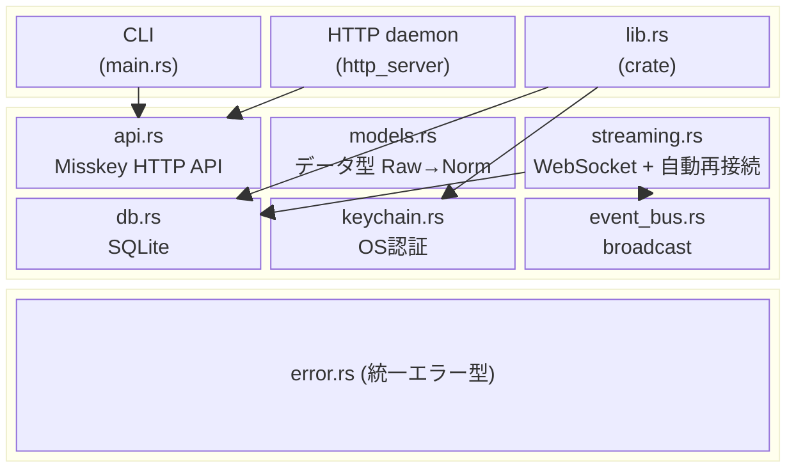
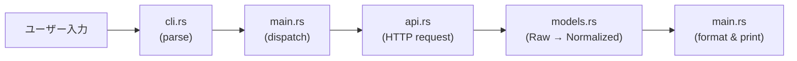
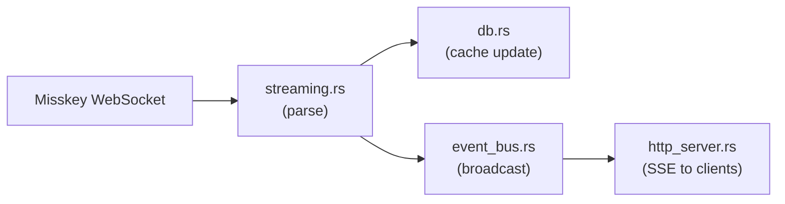
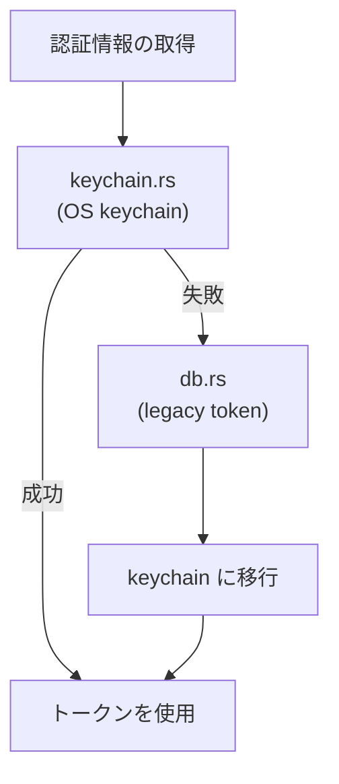

# アーキテクチャ

## 設計理念

**notecli = headless Misskey client library + CLI frontend**

- コアロジック（api, models, db, streaming）はライブラリとして再利用可能
- CLI と HTTP daemon はそのライブラリの「フロントエンド」
- NoteDeck は HTTP API 経由で利用する消費者の一つであり、notecli を支配しない

### 判断基準

変更を加えるとき「これは Misskey クライアントライブラリとして汎用的か？」を問う。
Yes → notecli に入れる。No → 消費者側（NoteDeck 等）で実装する。

## レイヤー構成

## モジュール責務

| モジュール | 責務 | 依存先 |
|-----------|------|--------|
| `api.rs` | Misskey HTTP API のラッパー。ステートレス | models, error |
| `models.rs` | Raw（API応答）→ Normalized（内部表現）変換 | - |
| `db.rs` | SQLite 永続化（accounts, cache, servers） | models, error |
| `streaming.rs` | WebSocket 接続管理、自動再接続、イベント発行 | models, db, event_bus, error |
| `event_bus.rs` | tokio broadcast ベースの pub/sub | - |
| `http_server.rs` | Axum REST API + SSE。`build_core_routes()` で外部から構築可能 | api, db, models, event_bus, error |
| `keychain.rs` | OS ネイティブ keychain 抽象化 | error |
| `error.rs` | `NotecliError` 統一エラー型。トークン漏洩防止 | - |
| `cli.rs` | clap コマンド定義 | - |
| `main.rs` | CLI ディスパッチ + daemon 起動 + 出力フォーマット | 全モジュール |
| `lib.rs` | ライブラリ公開 API + `get_credentials()` | db, keychain |

## データフロー

### CLI コマンド実行

### Streaming（daemon モード）

### 認証情報の解決

## 今後の改善方針

1. **main.rs の分割**: 出力フォーマットを `output.rs` に、daemon 起動を `daemon.rs` に分離
2. **テスト追加**: models.rs の変換ロジック、api.rs のレスポンスパース、認証フォールバック
3. **ライブラリ API の安定化**: `lib.rs` の公開 API を整理し、semver に従う
